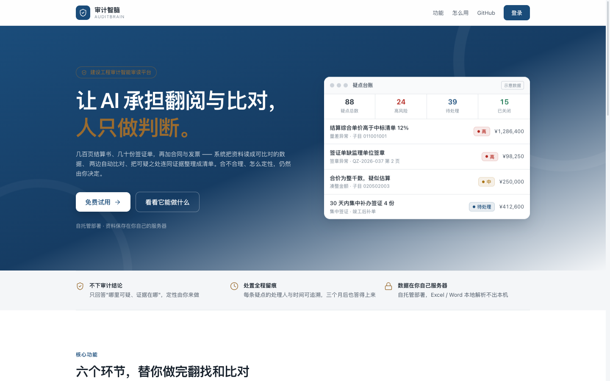
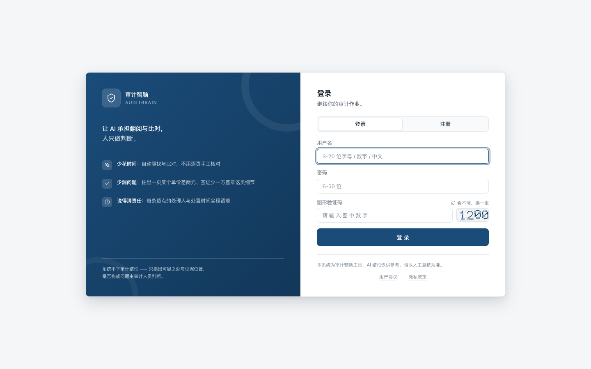

# 审计智脑 AuditBrain

> 面向**建设工程审计**的智能审读平台：把资料读成可比对的数据，两边自动比对，把可疑之处连同证据整理成清单。
> **让 AI 承担翻阅与比对，人只做判断。**

技术栈：**Next.js 14（App Router） + TypeScript + Tailwind CSS + MySQL**，AI 能力由 **PaddleOCR-VL（资料识别）** 与 **火山方舟大模型（审计推理）** 提供。





*截图为当前版本界面（v1.1.x）。落地页内的疑点台账为示意数据，非真实项目结果。*

---

## 它做什么，不做什么

这一点比功能列表更重要，先说清楚：

| | 说明 |
| --- | --- |
| **做什么** | 资料解析、清单 ↔ 结算勾稽、三方签章证据链核对、带证据出处的问答、疑点台账与处置留痕、Excel / Word 成果导出 |
| **不做什么** | **不产出审计结论**。它只回答"哪里可能有问题、证据在哪里"，最终结论由人下 |
| **核不到怎么办** | 明确标记为**「无法确认」**，而不是假装"没问题"——防止把没核到当成已核过 |
| **数据在哪** | 自托管部署，资料保存在你自己的服务器；Excel / Word 本机解析不出本机 |

把"不做什么"写在最前面，是刻意的设计。审计工作里，**一条被当成结论的提示，比一条漏掉的提示更危险**。

## 面向谁

- 建设工程审计人员、建设单位（甲方）内审、造价咨询单位
- 需要处理大量清单、结算、合同、签证、发票、照片等资料，且要求每条判断都能回溯到原文的场景

## 来源与许可

本仓库是在开源项目 **[ai-smart-audit](https://github.com/xiangxiang088/ai-smart-audit)**（Apache License 2.0，作者 xiangxiang088）基础上的**二次开发**，不是从零原创。按 Apache License 2.0 第 4 条要求在此明确声明：

**沿用上游的部分**：审计域的数据库初始化与迁移脚本（`sql/v1.0.x`、`sql/v1.1.x` 中的审计项目 / 资料 / 要素 / 问答 / 核对 / 模型配置表结构，同名脚本已在文件头部标注来源）、数据库连接与雪花 ID 两个基础组件（`src/lib/db.ts`、`src/lib/snowflake.ts`，由上游 `server/db.js`、`server/utils/snowflake.js` 改写，文件头部已标注来源与改动）。

**本仓库做的修改**：
- 技术栈重写：上游为 Express + 原生 HTML/JS，本仓库改为 **Next.js 14 App Router + TypeScript + Tailwind CSS**（服务端逻辑迁至 Route Handlers，前端改为 React 组件化）
- 移除上游「清标分析」模块（见 `sql/v1.1.x/20260927-drop-bid-clearing.sql`）
- 新增项目成员与权限（`audit_project_member`）、疑点处置留痕（`audit_finding_dispose`）、资料原件 Blob 存储等表与功能
- 新增图形验证码、隐私政策、用户协议、SEO / OG、对外落地页
- 前端设计系统重做（藏青 + 铜金令牌、线性图标、响应式外壳）

原始版权与许可声明保留在 [`LICENSE`](./LICENSE)。本仓库同样以 **Apache License 2.0** 发布。

## 项目状态

**个人独立完成的二次开发，目前无外部客户。** 源码公开可查，功能范围与限制全部写在下面，不做任何夸大：

- 基础链路（注册 → 建项目 → 上传 → 解析 → 问答 → 核对 → 疑点 → 导出）已实现，生产构建通过
- 核对程序目前**只实现 2 种**（清单 ↔ 结算、三方签章），另两种已声明枚举但无实现
- 外部 AI 能力依赖第三方密钥（`OCR_KEY` / `ARK_API_KEY`），未配置时相关功能不可用，也不会有资料外发
- AI 相关链路尚未做全链路生产联调（见「待完善」）

想先看样例成果，或聊聊你的项目场景：**hk15186498013@163.com**

## 目录

- [它做什么，不做什么](#它做什么不做什么)
- [面向谁](#面向谁)
- [来源与许可](#来源与许可)
- [项目状态](#项目状态)
- [技术栈](#技术栈)
- [目录结构](#目录结构)
- [快速开始](#快速开始)
- [部署（生产）](#部署生产)
- [外部 AI 能力（可选）](#外部-ai-能力可选)
- [功能模块](#功能模块)
- [已知限制](#已知限制)
- [联系与反馈](#联系与反馈)
- [许可](#许可)

## 技术栈

- 前端：Next.js 14 App Router、React 18、TypeScript、Tailwind CSS（深浅色主题）
- 后端：Next.js Route Handlers（`src/app/api/**`），统一 `/api` 契约
- 数据库：MySQL + `mysql2`（雪花 ID 主键）
- 认证：JWT（Bearer + 密码哈希）+ RBAC（角色 / 菜单权限键）
- AI：PaddleOCR-VL（资料"眼睛"）、火山方舟大模型（审计"大脑"，含模型链故障转移）
- 导出：`docx` / `xlsx` 服务端生成

## 目录结构

```
src/
  app/
    (app)/            # 受保护的后台布局（侧边栏 + 顶栏）
      cockpit/ projects/ documents/ chat/ checks/ findings/ admin/ profile/
    api/              # Route Handlers（auth / audit/* / version）
  lib/audit/member.ts # 项目成员（owner/reviewer）可见性判定
    login/ page.tsx   # 登录 / 注册
  components/         # UI 原子组件 + 布局（AppShell / Providers / Toast）
  lib/                # db / auth / snowflake / configStore / apiClient / constants
  types/              # 实体 TS 类型
sql/                  # 数据库初始化脚本（v1.0.x / v1.1.x）
uploads/              # 运行时上传目录（gitignore）
docs/screenshots/     # README 用界面截图
```

## 快速开始

### 1. 安装依赖
```bash
npm install
```

### 2. 配置环境变量
```bash
cp .env.example .env
# 编辑 .env，至少填好 DB_* 与 JWT_SECRET（openssl rand -base64 48 生成）
```

### 3. 初始化数据库（需本地 / 远程 MySQL）
```bash
# 先手动创建库：CREATE DATABASE ai_audit CHARACTER SET utf8mb4;
node scripts/migrate.mjs      # 按 v1.0.x → v1.1.x 顺序执行全部 SQL
```

### 4. 启动
```bash
npm run dev      # 开发（http://localhost:3003）
# 或生产
npm run build && npm run start
```

### 5. 首次使用
打开 `http://localhost:3003` → 注册第一个账号（自动成为管理员）→ 进入「审计项目」创建项目 → 进入「资料舱」上传资料。

## 部署（生产）

### 1. 启动 Node 服务
```bash
npm ci
npm run build
NODE_ENV=production npm run start     # 端口取自 .env 的 PORT（默认 3003）
```
建议用 `systemd` / `pm2` 托管，监听 `127.0.0.1:3003`，由反向代理对外暴露。

### 2. 反向代理（OpenResty）
配置样例见 [`deploy/openresty/audit-brain.conf`](deploy/openresty/audit-brain.conf)，语法与 nginx 兼容。放到 `/usr/local/openresty/nginx/conf/conf.d/` 下，改好域名、证书路径与上游端口后：
```bash
openresty -t && openresty -s reload
```

需要重点关注的几处（样例中已配好）：

| 场景 | 关键配置 | 原因 |
| --- | --- | --- |
| SSE 流式问答 `/api/audit/chat/` | `proxy_buffering off`、`gzip off` | 否则令牌被缓冲，整段结束才吐给前端 |
| 文档解析 `/api/audit/documents/` | `proxy_read_timeout 1800s` | PaddleOCR-VL 轮询耗时长（`OCR_TIMEOUT_MS` 默认 600s） |
| 核对执行 `/api/audit/checks/` | `proxy_read_timeout 1800s` | 避免长任务中途 504 |
| 资料上传 | `client_max_body_size 200m`、`proxy_request_buffering off` | 扫描件 / 大 PDF 直传后端 |
| 上传原件 `/uploads/` | `return 404` | 审计原件含敏感信息，禁止匿名直链 |

> **上传原件的访问路径**：原件落在 `public/uploads/`，但一律通过带鉴权的 `/api/files/*` 读取
> （应用侧用 `beforeFiles` rewrite 把 `/uploads/*` 转发过去，OpenResty 样例里再显式 `return 404` 兜底）。
> 前端以 `fetch` + Bearer 取回 blob 后再打开，直接 `<a href>` 不带鉴权头会被 401。
> 部署后请确认 `GET /uploads/<任意路径>` 返回 401 或 404，而非文件内容。

> 注：`.env` 中的 `TRUST_PROXY`、`ALLOWED_ORIGINS` 目前尚未被代码消费，配置里的真实 IP 透传为后续启用预留。

## 外部 AI 能力（可选）
- 资料解析需要 PaddleOCR-VL（AI Studio）密钥：`OCR_KEY`
- 智能问答 / 核对需要火山方舟密钥：`ARK_API_KEY`
- 未配置时，相关功能在界面给出"未配置密钥"提示，其余功能正常。

## 功能模块

**基础能力（已完成，生产构建通过）**
- 脚手架、Tailwind 设计令牌、深浅色主题、响应式 AppShell（侧边栏 / 顶栏 / 项目上下文）
- 基础设施：db / snowflake / auth(JWT+RBAC) / configStore（统一配置中心，密钥脱敏）/ apiClient / 类型
- 认证：登录 / 注册 / 改密 / me + 登录页 + 路由守卫
- 个人设置：资料维护（昵称 / 邮箱，`PUT /api/auth/me`）+ 改密 + 主题偏好 + 当前项目上下文
- 审计项目：列表 / 新建 / 详情 / 更新 / 删除 API + 卡片页 + 项目详情页 + 驾驶舱统计
- 项目协作：`audit_project_member` 成员表（owner 归属人 / reviewer 复核人）+ 成员分配 UI + 顶栏项目切换器
- 资料舱：上传 + 解析（PaddleOCR-VL 管线）+ 原件查看（Excel / Word / OCR bbox 框线）
- 智能问答：SSE 流式 + 证据溯源角标 / 抽屉 + Agent 取证工具（模型链故障转移）
- 核对程序 + 疑点台账：确定性核对逻辑 + 规则扫描 + 处置 + 导出
- 疑点处置留痕：`audit_finding_dispose` 记录每次状态变更的处理人，按「项目+类型+标题」归档（兼容疑点扫描重建新 ID）；详情面板展示最近处理人 + 完整变更历史；已处置疑点禁止删除
- 后台 RBAC：用户 / 角色管理页 + 对应 API（幂等建表 + 种子数据）；菜单数据由 SQL 种子维护，仅提供只读接口供角色页分配权限
- 模型配置：审计大脑模型链配置页 + `/api/audit/ai-config`（GET / PUT / test / reload，故障转移编排）
- UI 原子组件库（Button / Card / Badge / Modal / Table / Input 等）

## 已知限制

公开这些不是自曝短处，是让你判断它能不能用在你的项目上：

1. 核对程序只实现了 2 种（清单↔结算、三方签章）；`contract_payment`（合同付款核对）与 `summary_tie`（汇总勾稽）在 `constants.ts` 中已声明枚举但无实现
2. 疑点规则产出 6 类；`no_photo`（缺少影像资料）、`duplicate`（重复计量）已声明枚举但暂无规则生成
3. 疑点台账无手工录入入口（`source='manual'` 不可达）——状态变更已通过 `audit_finding_dispose` 留痕并展示处理人，但疑点本身仍不能手工创建
4. 核对程序每次重跑会软删同类型历史记录（每种类型仅保留最近一次）
5. 列表接口未分页：疑点全量返回、资料硬上限 500、核对项硬上限 2000
6. 角色权限（`perm_key`）在 `sl_sys_menu` 中维护并可按角色分配，但审计域接口尚未按权限键校验；侧边栏菜单由前端硬编码，未读取 `/api/admin/menus/my`
7. OCR 页面底图未本地化（`localImage` 恒空），`bbox` 坐标已入库但前端未渲染框线
8. 头像字段（`avatar`）已在用户表预留，个人设置页暂未提供上传
9. 项目成员变更无留痕表（谁在何时把谁加为/移出项目），成员管理页不展示操作历史；疑点处置留痕已实现，成员变更尚未跟进

**待完善**
1. 外部 AI 集成**全链路联调**（需配置 MySQL + `ARK_API_KEY` + `OCR_KEY`）：`npm run build && npm run start` 后按自测指引冒烟（注册 → 建项目 → 上传 → 问答 → 核对 → 疑点）

## 联系与反馈

- 邮件：hk15186498013@163.com（想看样例成果、聊项目场景、报 bug 都可以）
- Issue：直接在仓库提，功能缺陷与规则误判尤其欢迎（附脱敏的样例数据更好）

## 许可

本项目以 **Apache License 2.0** 发布，详见 [`LICENSE`](./LICENSE)。

- 允许：商用、修改、分发、私有化部署、再授权
- 条件：保留 `LICENSE` 全文与原始版权声明；修改过的文件需说明改动；不得使用上游作者名义或原项目名背书
- 上游来源声明见「来源与许可」一节

如需商业合作或私有化部署支持：hk15186498013@163.com
